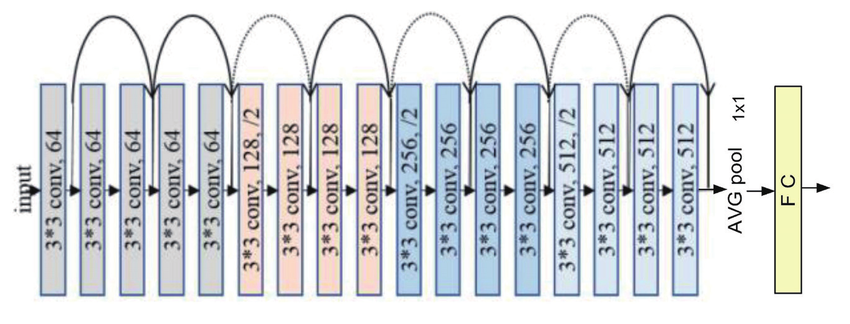
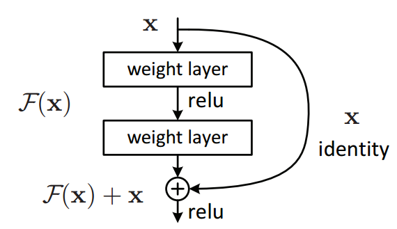

# ResNet3D-18 Real-Time Human Violence Detection

> **Last updated:** February 21, 2026

---

## Project Overview

This deep learning project is a portable software solution for **real-time human violence detection** from live video streams. The system leverages the **ResNet3D-18 (r3d_18)** 3D Convolutional Neural Network to classify 16-frame video clips as either **Violent** or **Non-Violent**, and surfaces the results through a Gradio-based web interface with live webcam integration.

The project also explores a supplementary **Vision Language Model (VLM) fine-tuning** pipeline for richer scene understanding and contextual analysis.

### Key Highlights
- 🎯 **Binary classification** — Violent vs Non-Violent from short video clips
- 🏎️ **Dual device support** — runs on both CPU and CUDA (GPU)
- 🔴 **Confidence-gated alerting** — requires ≥ 85% confidence sustained over 5 consecutive frames before raising a VIOLENT alert
- 🌐 **Gradio web interface** — no CLI expertise needed to run inference
- 🧠 **VLM fine-tuning notebook** — experimental multimodal analysis track

---

## Architecture Diagrams

**ResNet-18 3D CNN**



**Residual Block**



---

## Repository Structure

```
PCL_repository/
├── 3d_cnn_with_videos.ipynb        # Primary training notebook (ResNet3D-18)
├── 3d_cnn_with_videos_data2.ipynb  # Training notebook — alternate dataset (data2/)
├── VLM_model_FineTuning.ipynb      # VLM fine-tuning notebook
├── tester.py                       # Gradio inference app for live webcam testing
├── requirements.txt                # Python dependencies
│
├── best_model_weights.pth          # Best checkpoint — training run 1
├── best_model_v2_weights.pth       # Best checkpoint — training run 2
├── violence_classifier.pth         # Production model weights v1
├── violence_classifier_v2.pth      # Production model weights v2
│
├── data2/                          # Alternate video dataset (2000 clips)
├── raw_data/                       # Raw source video data
├── violence-detection-dataset/     # Primary structured dataset
│
├── Assets/Images/                  # Architecture diagrams
├── CONTRIBUTING.md                 # Project team / contributors
├── CITATION.cff                    # Citation metadata
└── LICENSE                         # MIT License
```

---

## Features

| Feature | Details |
|---|---|
| **Real-Time Webcam Inference** | Streams frames from webcam, classifies 16-frame rolling clips |
| **Confidence Thresholding** | Only flags VIOLENT after 5 consecutive frames ≥ 85% confidence |
| **CPU & CUDA Support** | Selectable at runtime via the Gradio UI |
| **Model Hot-Swapping** | Load any `.pth` model file path at runtime without restarting |
| **Multi-Camera Support** | Dropdown to select webcam index (0, 1, 2 …) |
| **Live Overlay** | Prediction label and confidence bar rendered on the output frame |
| **VLM Fine-Tuning** | Experimental notebook for multimodal violence detection |

---

## Requirements

**Python:** 3.9+

| Package | Min Version |
|---|---|
| `torch` | ≥ 2.3.0 |
| `torchvision` | ≥ 0.18.0 |
| `gradio` | ≥ 4.26.0 |
| `opencv-python` | ≥ 4.9.0.80 |
| `numpy` | ≥ 1.26.4 |
| `decord` | latest |
| `scikit-learn` | latest |
| `matplotlib` | latest |
| `huggingface-hub` | latest |
| `safetensors` | latest |
| `onnx`, `onnxruntime`, `onnxruntime-gpu` | latest |
| `psutil`, `py-cpuinfo`, `scipy`, `PyYAML` | latest |

Full list: see [`requirements.txt`](requirements.txt)

---

## Installation

> **Note:** This repository is private. Installation requires collaborator access.

```bash
# 1. Clone the repository (requires collaborator access)
gh repo clone heytanix/PCL_repository
cd PCL_repository

# 2. (Recommended) Create a virtual environment
python -m venv .venv
source .venv/bin/activate

# 3. Install dependencies
pip install -r requirements.txt
```

---

## Usage

### 🧪 Running the Inference App (`tester.py`)

```bash
python tester.py
```

The Gradio web interface will launch at **`http://127.0.0.1:7860`** by default.

**Steps in the UI:**
1. **Model Path** — Enter the full path to a `.pth` weights file (e.g., `violence_classifier_v2.pth`)
2. **Device** — Select `cpu` or `cuda` (auto-detected)
3. **Load Model** — Click the 🔄 Load Model button; wait for ✅ confirmation
4. **Webcam** — Select your camera device index (usually `0`)
5. **Start Streaming** — Point the webcam at the scene; predictions appear in real time

**Detection legend:**

| Indicator | Meaning |
|---|---|
| 🟢 Non-Violent | Normal activity detected |
| 🟠 Possible Violent | Single high-confidence detection (≥ 85%) |
| 🔴 VIOLENT | 5 consecutive detections ≥ 85% confidence |

---

### 🏋️ Training the Model

**Primary training notebook:**
```
3d_cnn_with_videos.ipynb
```
- Reads MP4 clips from `violent/` and `non-violent/` subdirectories
- Performs scene-level train / val / test split (stratified)
- Applies class balancing via oversampling (e.g., 158 violent / 158 non-violent after balancing)
- Trains a `torchvision.models.video.r3d_18` model with a custom classification head (`Dropout(0.5) → Linear(512 → 2)`)
- Saves checkpoints as `best_model_weights.pth` and the final model as `violence_classifier.pth`

**Alternate dataset notebook:**
```
3d_cnn_with_videos_data2.ipynb
```
Same pipeline but trained on the `data2/` dataset (2000 video clips). Produces `best_model_v2_weights.pth` and `violence_classifier_v2.pth`.

---

### 🔬 VLM Fine-Tuning (Experimental)

```
VLM_model_FineTuning.ipynb
```
Fine-tunes a Vision Language Model for contextual, multimodal scene analysis. This track is experimental and supplementary to the core CNN detection pipeline.

---

## Model Details

| Property | Value |
|---|---|
| **Base Architecture** | ResNet3D-18 (`r3d_18` from `torchvision`) |
| **Input** | 16 frames × 3 channels × 112 × 112 px |
| **Classification Head** | `Dropout(p=0.5)` → `Linear(512 → 2)` |
| **Normalization** | Mean `[0.432, 0.395, 0.376]`, Std `[0.228, 0.221, 0.217]` |
| **Classes** | `0` = Non-Violent, `1` = Violent |
| **Violence Threshold** | 0.85 (85% confidence) |
| **Vote Buffer** | 5 consecutive frames required for sustained VIOLENT alert |

---

## Project Team

See [`CONTRIBUTING.md`](CONTRIBUTING.md) for the full list of contributors.

| Name | Role |
|---|---|
| Thanish Chinnappa KC | Lead Developer |
| Tejas RU | Co-Developer |
| Tanisha Vernekar | Documentation |
| Sujeeth RK | Research Paper In-charge |
| Uday S Gowda | Data Analyst |

---

## License

This project is licensed under the **MIT License**. See the [`LICENSE`](LICENSE) file for details.
